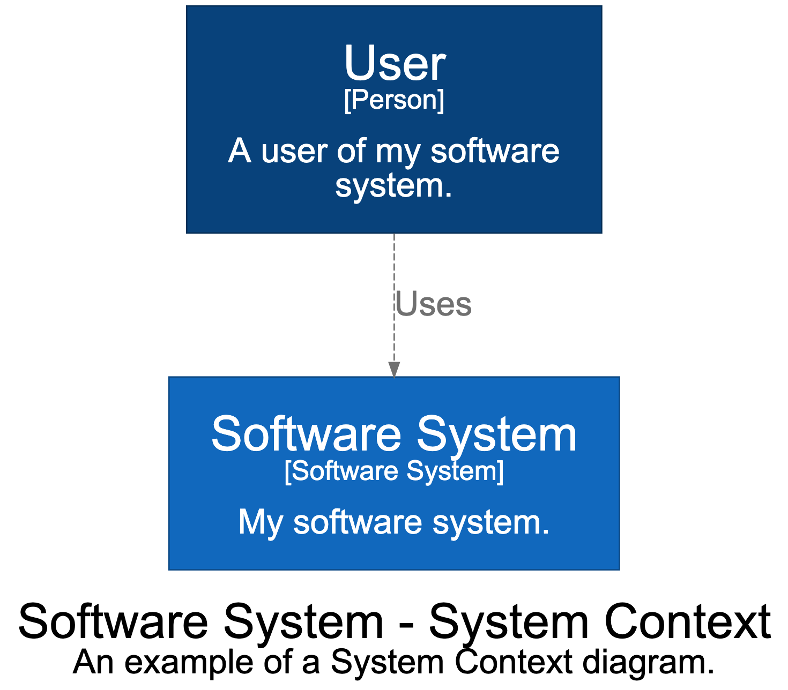

# structurizr-dot

structurizr-dot can export the views in a Structurizr workspace to DOT diagram definitions that are compatible with Graphviz. The following diagram types are supported:

- System Landscape
- System Context
- Container
- Component
- Dynamic
- Deployment

Create your software architecture model and views as usual, and use the [DOTWriter](https://github.com/structurizr/java-extensions/blob/master/structurizr-dot/src/com/structurizr/io/dot/DOTWriter.java) class to export the views. [For example](https://github.com/structurizr/java-extensions/blob/master/structurizr-examples/src/com/structurizr/example/DOT.java):

```java
Workspace workspace = new Workspace("Getting Started", "This is a model of my software system.");
Model model = workspace.getModel();

Person user = model.addPerson("User", "A user of my software system.");
SoftwareSystem softwareSystem = model.addSoftwareSystem("Software System", "My software system.");
user.uses(softwareSystem, "Uses");

ViewSet views = workspace.getViews();
SystemContextView contextView = views.createSystemContextView(softwareSystem, "SystemContext", "An example of a System Context diagram.");
contextView.addAllSoftwareSystems();
contextView.addAllPeople();

Styles styles = views.getConfiguration().getStyles();
styles.addElementStyle(Tags.SOFTWARE_SYSTEM).background("#1168bd").color("#ffffff");
styles.addElementStyle(Tags.PERSON).background("#08427b").color("#ffffff").shape(Shape.Person);

DOTWriter dotWriter = new DOTWriter();
System.out.println(dotWriter.toString(contextView));
```

This code will generate and output a DOT diagram definition that looks like this:

```
digraph {
  compound=true
  graph [fontname="Arial", rankdir=TB, ranksep=1.0, nodesep=1.0]
  node [fontname="Arial", shape=box, margin="0.4,0.3"]
  edge [fontname="Arial"]
  label=<<br /><font point-size="34">Software System - System Context</font><br /><font point-size="24">An example of a System Context diagram.</font>>
  subgraph cluster_enterprise {
    margin=25
    label=<<font point-size="24"><br />Enterprise</font><br /><font point-size="19">[Enterprise]</font>>
    labelloc=b
    color="#444444"
    fontcolor="#444444"
    fillcolor="#ffffff"
  }

  1 [id=1,shape=rect, label=<<font point-size="34">User</font><br /><font point-size="19">[Person]</font><br /><br /><font point-size="24">A user of my software<br />system.</font>>, style=filled, color="#052e56", fillcolor="#08427b", fontcolor="#ffffff"]
  2 [id=2,shape=rect, label=<<font point-size="34">Software System</font><br /><font point-size="19">[Software System]</font><br /><br /><font point-size="24">My software system.</font>>, style=filled, color="#0b4884", fillcolor="#1168bd", fontcolor="#ffffff"]

  1 -> 2 [id=3, label=<<font point-size="24">Uses</font>>, style="dashed", color="#707070", fontcolor="#707070"]
}
```

If you render this with Graphviz, you will get something like this:



## Changelog

### 1.0.0 (unreleased)

- Initial version.