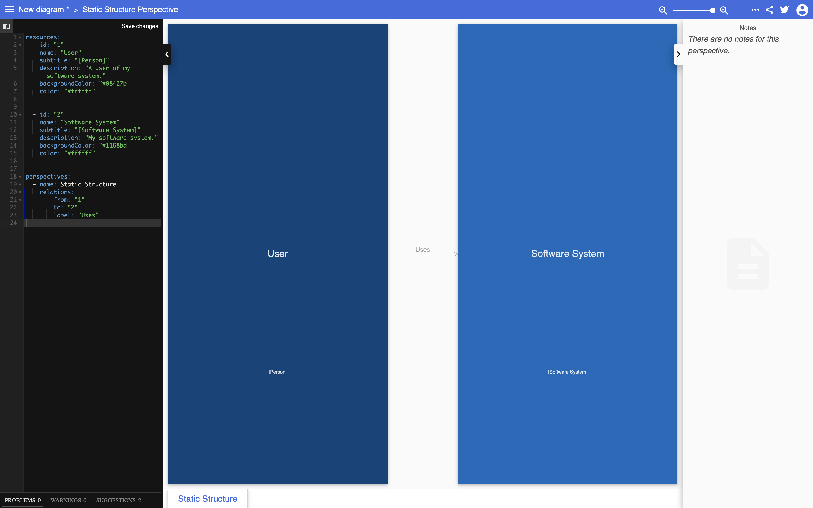
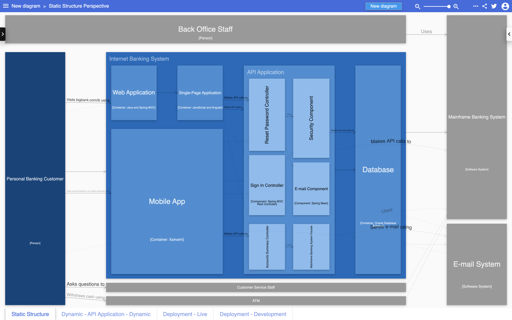

# structurizr-ilograph

structurizr-ilograph can export a Structurizr workspace to an [Ilograph](https://www.ilograph.com) definition.

Create your software architecture model and views as usual, and use the [IlographWriter](https://github.com/structurizr/java-extensions/blob/master/structurizr-ilograph/src/com/structurizr/io/ilograph/IlographWriter.java) class to export the workspace. [For example](https://github.com/structurizr/java-extensions/blob/master/structurizr-examples/src/com/structurizr/example/Ilograph.java):

```java
Workspace workspace = new Workspace("Getting Started", "This is a model of my software system.");
Model model = workspace.getModel();

Person user = model.addPerson("User", "A user of my software system.");
SoftwareSystem softwareSystem = model.addSoftwareSystem("Software System", "My software system.");
user.uses(softwareSystem, "Uses");

ViewSet views = workspace.getViews();
SystemContextView contextView = views.createSystemContextView(softwareSystem, "SystemContext", "An example of a System Context diagram.");
contextView.addAllSoftwareSystems();
contextView.addAllPeople();

Styles styles = views.getConfiguration().getStyles();
styles.addElementStyle(Tags.SOFTWARE_SYSTEM).background("#1168bd").color("#ffffff");
styles.addElementStyle(Tags.PERSON).background("#08427b").color("#ffffff").shape(Shape.Person);

IlographWriter ilographWriter = new IlographWriter();
System.out.println(ilographWriter.toString(workspace));
```

This code will generate and output an Ilograph definition that looks like this:

```
resources:
  - id: "1"
    name: "User"
    subtitle: "[Person]"
    description: "A user of my software system."
    backgroundColor: "#08427b"
    color: "#ffffff"


  - id: "2"
    name: "Software System"
    subtitle: "[Software System]"
    description: "My software system."
    backgroundColor: "#1168bd"
    color: "#ffffff"


perspectives:
  - name: Static Structure
    relations:
      - from: "1"
        to: "2"
        label: "Uses"
```

If you copy/paste this into [Ilograph](https://app.ilograph.com/), you will get something like this:



Here's what the [Big Bank plc workspace](https://structurizr.com/share/36141/) looks like when rendered in Ilograph. 




## Changelog

### 1.0.0 (14th August 2020)

- Initial version.