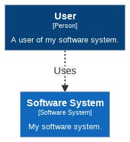

# structurizr-mermaid

structurizr-mermaid can export the views in a Structurizr workspace to diagram definitions that are compatible with [Mermaid](https://mermaid-js.github.io/mermaid). The following diagram types are supported:

- System Landscape
- System Context
- Container
- Component
- Dynamic
- Deployment

Create your software architecture model and views as usual, and use the [MermaidWriter](https://github.com/structurizr/java-extensions/blob/master/structurizr-mermaid/src/com/structurizr/io/mermaid/MermaidWriter.java) class to export the views. [For example](https://github.com/structurizr/java-extensions/blob/master/structurizr-examples/src/com/structurizr/example/Mermaid.java):

```java
Workspace workspace = new Workspace("Getting Started", "This is a model of my software system.");
Model model = workspace.getModel();

Person user = model.addPerson("User", "A user of my software system.");
SoftwareSystem softwareSystem = model.addSoftwareSystem("Software System", "My software system.");
user.uses(softwareSystem, "Uses");

ViewSet views = workspace.getViews();
SystemContextView contextView = views.createSystemContextView(softwareSystem, "SystemContext", "An example of a System Context diagram.");
contextView.addAllSoftwareSystems();
contextView.addAllPeople();

Styles styles = views.getConfiguration().getStyles();
styles.addElementStyle(Tags.SOFTWARE_SYSTEM).background("#1168bd").color("#ffffff");
styles.addElementStyle(Tags.PERSON).background("#08427b").color("#ffffff").shape(Shape.Person);

MermaidWriter mermaidWriter = new MermaidWriter();
System.out.println(mermaidWriter.toString(contextView));
```

This code will generate and output a Mermaid diagram definition that looks like this:

```
graph TB
  linkStyle default fill:#ffffff
  1["<div style='font-weight: bold'>User</div><div style='font-size: 70%; margin-top: 0px'>[Person]</div><div style='font-size: 80%; margin-top:10px'>A user of my software system.</div>"]
  style 1 fill:#08427b,stroke:#052e56,color:#ffffff
  2["<div style='font-weight: bold'>Software System</div><div style='font-size: 70%; margin-top: 0px'>[Software System]</div><div style='font-size: 80%; margin-top:10px'>My software system.</div>"]
  style 2 fill:#1168bd,stroke:#0b4884,color:#ffffff
  1-. "<div>Uses</div><div style='font-size: 70%'></div>" .->2
```

If you copy/paste this into the [Mermaid live editor](https://mermaid-js.github.io/mermaid-live-editor/), you will get something like this:



(you will need add the following property to the Mermaid configuration: ```"securityLevel": "loose"```)

## Changelog

### 1.4.0 (unreleased)

- Adds support for return/response messages on dynamic views.
- Adds support for software system instances on deployment views.
- Fixes a bug where all children of a deployment node would be rendered on a deployment view, irrespective of the defined elements.

### 1.3.6 (6th July 2020)

- Add support for colouring deployment nodes (text and border).
- Shape borders are now rendered in a darker version of the background, rather than grey.
- Graph direction is now taken from the view's auto-layout settings.

### 1.3.5 (27th June 2020)

- Improved rendering of all diagrams.
- Adds support for infrastructure nodes.