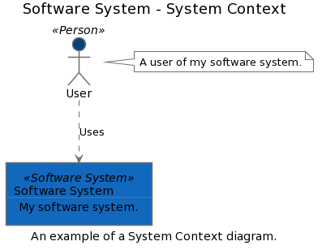

# structurizr-plantuml

structurizr-plantuml can export the views in a Structurizr workspace to diagram definitions that are compatible with [PlantUML](http://www.plantuml.com). The following diagram types are supported:

- System Landscape
- System Context
- Container
- Component
- Dynamic
- Deployment

Create your software architecture model and views as usual, and use the [PlantUMLWriter](https://github.com/structurizr/java/blob/master/structurizr-plantuml/src/com/structurizr/io/plantuml/PlantUMLWriter.java) class to export the views. [For example](https://github.com/structurizr/java-extensions/blob/master/structurizr-examples/src/com/structurizr/example/PlantUML.java):

```java
Workspace workspace = new Workspace("Getting Started", "This is a model of my software system.");
Model model = workspace.getModel();

Person user = model.addPerson("User", "A user of my software system.");
SoftwareSystem softwareSystem = model.addSoftwareSystem("Software System", "My software system.");
user.uses(softwareSystem, "Uses");

ViewSet views = workspace.getViews();
SystemContextView contextView = views.createSystemContextView(softwareSystem, "SystemContext", "An example of a System Context diagram.");
contextView.addAllSoftwareSystems();
contextView.addAllPeople();

Styles styles = views.getConfiguration().getStyles();
styles.addElementStyle(Tags.SOFTWARE_SYSTEM).background("#1168bd").color("#ffffff");
        styles.addElementStyle(Tags.PERSON).background("#08427b").color("#ffffff").shape(Shape.Person);

PlantUMLWriter plantUMLWriter = new PlantUMLWriter();
plantUMLWriter.toStdOut(workspace);
```

This code will generate and output a PlantUML diagram definition that looks like this:

```
@startuml
scale max 2000x2000
title Software System - System Context
caption An example of a System Context diagram.

skinparam {
  shadowing false
  arrowColor #707070
  actorBorderColor #707070
  componentBorderColor #707070
  rectangleBorderColor #707070
  noteBackgroundColor #ffffff
  noteBorderColor #707070
}
actor "User" <<Person>> as 1 #08427b
note right of 1
  A user of my software system.
end note
rectangle 2 <<Software System>> #1168bd [
  Software System
  --
  My software system.
]
1 .[#707070].> 2 : Uses
@enduml
```

If you copy/paste this into [PlantUML online](http://www.plantuml.com/plantuml/), you will get something like this:



## Changelog

### 1.3.8 (unreleased)

- Adds support for infrastructure nodes.
- Element types are now always included in the stereotypes.

### 1.3.7 (22nd June 2020)

- Allows customization of C4-PlantUML URL, so that different forks can be used.

### 1.3.6 (19th June 2020)

- Fixes the ordering of elements on a sequence diagram.

### 1.3.1 (29th October 2019)

- The structurizr-annotations library can now be more easily used with OSGi applications.
- Fixes a bug with the PlantUML and WebSequenceDiagram writers, where relationships were sorted incorrectly (alphabetically, rather than numerically).