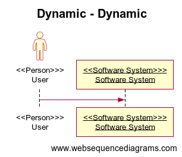

# structurizr-websequencediagrams
structurizr-websequencediagrams can export the dynamic views in a Structurizr workspace to diagram definitions that are compatible with [WebSequenceDiagrams](https://www.websequencediagrams.com).

Create your software architecture model and views as usual, and use the [WebSequenceDiagramsWriter](https://github.com/structurizr/java-extensions/blob/master/structurizr-websequencediagrams/src/com/structurizr/io/websequencediagrams/WebSequenceDiagramsWriter.java) class to export the views. [For example](https://github.com/structurizr/java-extensions/blob/master/structurizr-examples/src/com/structurizr/example/WebSequenceDiagrams.java):

```java
Workspace workspace = new Workspace("Getting Started", "This is a model of my software system.");
Model model = workspace.getModel();

Person user = model.addPerson("User", "A user of my software system.");
SoftwareSystem softwareSystem = model.addSoftwareSystem("Software System", "My software system.");
user.uses(softwareSystem, "Uses");

ViewSet views = workspace.getViews();
DynamicView dynamicView = views.createDynamicView("Dynamic", "An example of a dynamic diagram.");
dynamicView.add(user, softwareSystem);

Styles styles = views.getConfiguration().getStyles();
styles.addElementStyle(Tags.SOFTWARE_SYSTEM).background("#1168bd").color("#ffffff");
styles.addElementStyle(Tags.PERSON).background("#08427b").color("#ffffff").shape(Shape.Person);

WebSequenceDiagramsWriter webSequenceDiagramsWriter = new WebSequenceDiagramsWriter();
webSequenceDiagramsWriter.toStdOut(workspace);
```

This code will generate and output a PlantUML diagram definition that looks like this:

```
title Dynamic - Dynamic

actor <<Person>>>\nUser as User
participant <<Software System>>>\nSoftware System as Software System

User->Software System: 
```

If you copy/paste this into [WebSequenceDiagrams](https://www.websequencediagrams.com), you will get something like this:



## Changelog

### 1.4.1 (28th March 2021)

- Uses custom terminology, if defined in the workspace.

### 1.4.0 (14th August 2020)

- Adds support for return/response messages on dynamic views.

### 1.3.6 (19th June 2020)

- Fixes the ordering of elements on a sequence diagram.

### 1.3.1 (29th October 2019)

- Fixes a bug where relationships were sorted incorrectly (alphabetically, rather than numerically).